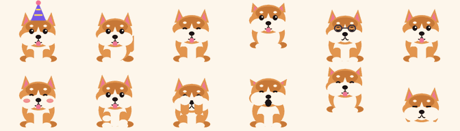

<h1 align="center">🐕 Chimtu</h1>
<p align="center"><b>A tiny Shiba desktop pet that lives on your screen and reacts to what you do.</b><br>
Named after the Telugu internet meme. Native on macOS, ported to Windows. ~0.1% CPU. Now with memory, moods, a settings window and optional sounds.</p>

<p align="center">
  <a href="https://github.com/vardhan23v/chimtu-pet/actions/workflows/release.yml"></a>
  <a href="https://github.com/vardhan23v/chimtu-pet/releases/latest"></a>
  <a href="https://github.com/vardhan23v/chimtu-pet/releases"></a>
  <a href="LICENSE"></a>
</p>
<p align="center">
  
  
  
  
  
  
  
</p>

<p align="center"></p>

## Table of contents

1. [Install](#install)
2. [Quick tour](#quick-tour)
3. [How Chimtu works](#how-chimtu-works) — architecture, state machine, rendering, timers
4. [Feature guide](#feature-guide) — every feature, what it does, how it is triggered, how it is implemented
   - [Memory and mood](#memory-and-mood) · [Settings window](#settings-window) · [Sound](#sound) · [Skins, hats and phrases](#skins-hats-and-phrases) · [Idle life](#idle-life) · [Interacting with him](#interacting-with-him) · [Follow Cursor](#follow-cursor) · [Reactions to what you do](#reactions-to-what-you-do) · [Typing reactions](#typing-reactions) · [Speech bubbles](#speech-bubbles) · [Focus timer](#focus-timer) · [Reminders](#reminders) · [Music](#music) · [Hats, size, friends](#hats-size-and-friends) · [Stats](#hows-your-day) · [Night mode and battery awareness](#night-mode-and-battery-awareness) · [Menu reference](#menu-reference)
5. [Battery and performance](#battery-and-performance)
5b. [Testing](#testing)
6. [The artwork pipeline](#the-artwork-pipeline)
7. [Windows port](#windows-port)
8. [Build, CI and releases](#build-ci-and-releases)
9. [Privacy and permissions](#privacy-and-permissions)
10. [Troubleshooting](#troubleshooting)
11. [Project layout](#project-layout) · [License](#license)

## Install

Download from the [latest release](https://github.com/vardhan23v/chimtu-pet/releases/latest).

| Platform | File | Steps |
| --- | --- | --- |
| macOS 13+ (Apple Silicon and Intel, one universal binary) | `Chimtu-macOS.zip` | Unzip, drag `Chimtu.app` to `/Applications`. First launch: right-click → **Open** (the app is ad-hoc signed, not notarized, so Gatekeeper asks once). He appears as 🐕 in the menu bar; there is no Dock icon and no window to manage. |
| Windows 10 / 11 | `Chimtu-Windows.zip` | Unzip `Chimtu.exe` anywhere and run it. SmartScreen may warn once because the exe is unsigned: **More info → Run anyway**. Right-click Chimtu for his menu. |

On macOS he will also ask once for **Input Monitoring** so he can react to typing. That is optional: decline and everything else still works. See [Privacy and permissions](#privacy-and-permissions).

## Quick tour

Chimtu sits at the bottom-centre of your screen. Move the mouse and his eyes follow it. Click him and he waves. Hold the mouse button on him and he blushes. Drag him anywhere; he dangles while held and lands with a squash. Double-click and he jumps. Copy some text and he sniffs it. Start typing and he taps along. Open a new app and he gets excited about it. Leave him alone and he sits, naps, scratches, dances, chases his tail, or occasionally tears across the screen with the zoomies. Everything else is in the 🐕 menu.

## How Chimtu works

### Architecture

Chimtu is a small Swift package built with AppKit (no storyboards, no Xcode project), split into a pure **core** and a thin **app**:

| Module / file | Role |
| --- | --- |
| `Sources/ChimtuCore/Behaviour.swift` | Every tunable number: the weight table, burst thresholds, cooldowns, quiet hours, which states are gestures. The Python port asserts the same values. |
| `Sources/ChimtuCore/Brain.swift` | `Brain.chooseNext(context, rng)` — the pure state-selection function. Obligations first (focus, music, waking, loneliness), then the mood-weighted random table. Deterministic given the generator, so it is unit-tested with 100k-sample distributions. |
| `Sources/ChimtuCore/ReactionGate.swift` | `ReactionGate` (cooldown / gesture / held rules) and `BurstCounter` (sliding-window counters for tickles, drags, deletes, clicks, keys). |
| `Sources/ChimtuCore/Mood.swift`, `PetState.swift`, `Phrases.swift` | Mood maths, the persisted record + atomic JSON store, and the phrase table with overlays. |
| `Sources/ChimtuCoreChecks/main.swift` | 178 assertions over the core; runs with `swift run ChimtuCoreChecks` (no XCTest needed). |
| `Sources/Chimtu/main.swift` | Boots `NSApplication` as an *accessory* app (`LSUIElement`), which is what keeps him out of the Dock and the ⌘-Tab switcher. |
| `Sources/Chimtu/AppDelegate.swift` | Builds the menu-bar item and menu, and forwards every menu action to the pet. Also spawns extra pets for **Add a Friend**. |
| `Sources/Chimtu/PetWindow.swift` | `PetWindow` is a borderless, transparent, always-on-top `NSWindow` that joins every Space and ignores window cycling. `PetView` inside it owns three Core Animation layers: the **sprite**, the **hat** overlay, and the **speech bubble**. It also turns raw mouse events into click / double-click / long-press, and accepts file drops. |
| `Sources/Chimtu/PetController.swift` | One controller = one pet. Owns the window, the frame timer and the live state; builds a `BrainContext`, applies the `Decision`, and maps `SystemEvent`s to reactions through the gate. |
| `Sources/Chimtu/SystemObservers.swift` | All system observation in one shared object: workspace notifications, the global click and key monitors, the Downloads watcher, IOKit power callbacks, player notifications. Emits typed `SystemEvent`s to every pet. Categories the user disables are never registered. |
| `Sources/Chimtu/Preferences.swift`, `SettingsWindow.swift`, `SoundPlayer.swift` | One struct over `UserDefaults` (same keys as v1), the SwiftUI settings window, and the sound gate/player. |
| `Sources/Chimtu/Sprites.swift` | Loads the PNG frames from the app bundle once, decoding them into `CGImage`s, and knows each animation's frame count and frame rate. |

### The state machine

At any moment the pet is in exactly one **state**, which is the name of an animation (`idle`, `walk_left`, `sleep`, `laugh`, …). A state has a start time and an end time. `enter(state, for: seconds)` switches state, resets the frame index, and restarts the frame timer at that animation's rate. `for: 0` means "open-ended" — the state lasts until something else ends it (used by `held`, `focus`, `groove`, and Follow Cursor).

On every timer tick the controller:

1. Shows the current frame (and hides the hat for poses where it would float, such as roll or spin).
2. Advances the frame index.
3. Samples cheap things that piggyback on the tick: the mouse position (for cursor-aware idle and the "are you still there?" timer) and the pasteboard change counter (for sniffing).
4. Moves the window if the state is a walk, run, or zoomies.
5. If the state's end time has passed, calls `chooseNextState()`.

`chooseNextState()` first checks *obligations* (a focus session or music in progress, waking up, feeling lonely), then rolls a weighted random number for the next mood. Roughly: 40% idle, 22% sit, 12% sleep, and the remaining quarter spread over walking and the antics. This is what makes him feel alive without ever being busy.

**Reactions** are just states entered from outside the random loop. They go through a small gate, `react(...)`, which refuses to interrupt a gesture that is still playing, refuses while he is being held, and rate-limits to one reaction per 1.5 s so a flurry of events does not turn him into a blur. Some events (launching an app, plugging in the charger, a reminder firing) are marked `force` because you should never miss them.

### Rendering

Every animation is a handful of PNG frames at 224 × 192 px (2× for Retina; the pet is 112 × 96 pt on screen). At launch the frames are decoded once into `CGImage`s. Showing a frame is a single assignment to `CALayer.contents` inside a `CATransaction` with implicit animations disabled, so there is no drawing code on the hot path and no per-frame allocation. The hat is a second layer with the same frame as the sprite; the bubble is a `CATextLayer` on a rounded background above the sprite, and the window is tall enough to leave room for it.

### Timers

There is no display link and no run loop spinning. The pet uses:

- **One frame timer** whose interval is the current animation's frame period (from 1 fps for sleep to 16 fps for running). It carries a 50% tolerance, which lets macOS batch it with other wakeups. It is *invalidated* — not paused — whenever he is hidden, the display sleeps, the Mac sleeps, or the screen locks, and recreated when he comes back.
- **A 60 Hz mover** that exists only while Follow Cursor is actively moving him.
- **One-shot timers** for the hourly howl (fires on the hour with a minute of tolerance), focus sessions, and reminders.

## Feature guide

### Memory and mood

Chimtu remembers you between launches. On start he greets you by time of day ("Morning!", "Late night, hooman?"), or if you have been away more than eight hours, "Missed you! (2d)". He keeps a day streak and lifetime totals (pets, treats, clicks, keys, minutes together), all shown by **How's your day?** and in Settings → Stats.

He also has a **mood**: two slow values, *happiness* (baseline 0.6, nudged up by petting, treats, clicks and play, down by being dragged around or ignored, decaying back to baseline over a couple of hours) and *energy* (drains slowly while awake over roughly a workday, recovers while asleep). Mood never adds interruptions; it only re-weights the random table. Low energy makes naps more likely, high happiness makes antics more likely, and happiness below 0.3 lets a few idles turn into a sulk.

How it works: `PetState` is a versioned Codable record saved as JSON at `~/Library/Application Support/Chimtu/state.json` (Windows: `%APPDATA%\Chimtu\state.json`). Mood is integrated lazily whenever it is read, so it costs no timer. Saves happen on quit, hide, display sleep, and at most every five minutes while something changed; while unsaved changes exist the app opts out of sudden termination. A corrupt file is renamed `.bad` and he starts fresh. **Reset Chimtu** in Settings deletes the file.

### Settings window

Menu → **Settings…** (⌘,). A SwiftUI window with five tabs:

- **General**: Launch at Login, Size, Skin, Hat, Typing reactions.
- **Behaviour**: Chattiness (Quiet turns off idle chatter; reactions still speak), Quiet hours (default 11 pm – 6 am; replaces the old fixed night), and per-category reaction toggles: app events, clipboard, downloads & drives, music, global clicks, hourly howl. A disabled category is not merely ignored, its observer is never registered.
- **Sound**: enable, volume, preview.
- **Stats**: mood, energy, streak, totals, first-met date, Edit / Reload Phrases, Reset Chimtu.
- **About**: the real version number (now taken from the git tag at build time).

The window is created lazily and costs nothing while closed. Every setting is also mirrored in the menu where it existed before.

### Sound

Off by default. Eight tiny synthesized clips (bark, yip, awoo, sniff, snore, boing, chomp, ding; 108 KB total) are generated at build time by `tools/render_sounds.py` with nothing but the Python standard library. A table maps states to clips; jump and land only sound when *you* caused them. The gate allows at most one clip every six seconds and none during focus, quiet hours, or while suspended. Reminders and the focus finish always ding. Playback uses a throwaway `AVAudioPlayer` per clip, so no audio engine stays alive.

### Skins, hats and phrases

- **Skins**: *Shiba (red)* and *Cream*. The renderer is palette-parametrised, each skin is a full frame set under `frames/<skin>/`, and only the selected skin is decoded. Switching re-loads frames for every pet on screen without a restart.
- **Hats**: party hat, cap, crown, beanie, bow, flower. Overlay PNGs on a second layer, hidden for roll, spin, shake, sneeze and held.
- **Phrases**: every line Chimtu says has a key (`idle`, `bark`, `appLaunch`, `focusDone`, …). Settings → **Edit Phrases…** writes the defaults to `~/Library/Application Support/Chimtu/phrases.json` and opens it; edit any key, then **Reload Phrases**. Placeholders like `{app}`, `{name}`, `{minutes}`, `{time}` are substituted. A malformed file is ignored.

### Idle life

**Cursor-aware idle.** While idle his eyes look toward your pointer. There are three idle frame sets (`idle`, `idle_left`, `idle_right`); on each tick the controller compares the mouse x-position with the window centre and swaps to the matching set, keeping the frame index so the blink cycle is uninterrupted. When you click somewhere else on screen he glances there for 1.5 s instead (see the global click monitor below).

**Sit, sleep, yawn, stretch.** Sit lasts 6–15 s; sleep 15–40 s (or minutes at night). Waking always starts with a yawn or a full-body stretch, chosen at random. After a sit longer than 12 s there is a 50% chance he stretches before moving on.

**Antics.** Scratch (hind leg to the ear), shake (ears flapping), dance, spin (he turns through a back view), dig, sneeze (a two-frame wind-up, then the snap), roll over (sit → lie → tumble → pop up happy), chase tail, wink, hiccup (30% chance after eating, with "hic!"), bark, beg. All are entered from the random roll with small probabilities so no two minutes look the same.

**Zoomies.** A rare burst (also in the menu): he switches to the run cycle and moves 14 px per frame across the whole screen, bouncing off both edges and flipping direction sprite, for 3.5 s, shouting "ZOOMIES!". Skipped at night.

**Lonely.** The tick remembers the last time the mouse moved. After five minutes without movement he droops (`sad`) for three seconds, then takes a long nap of 1–3 minutes. He wakes as soon as any reaction fires.

**Walking.** Occasional short walks (2–5 s at 2.5 px per frame) left or right along whatever height you left him at, turning back before he reaches a screen edge.

### Interacting with him

| Gesture | What happens | How it is detected |
| --- | --- | --- |
| Click | Wave, then a happy wiggle, alternating on each click | `mouseUp` with `clickCount == 1` and the window did not move |
| Double-click | Jump (anticipation squash, arc, landing squash) | `clickCount == 2` |
| Four clicks in 2 s | Laughs: "Hehehe, tickles!" | Timestamps of clicks on the pet are kept; the recent-2-second count is checked |
| Eight clicks in 5 s | Peeks from behind his paws: "Shy!" | Same list, 5-second window; the list resets afterwards |
| Press and hold (> 0.5 s, no movement) | Blushes with ❤️ | `mouseDown` records the time and window origin; `mouseUp` compares |
| Drag | `held` pose (legs dangling, wide eyes) while you move him, then `land` squash | `NSWindow.willMoveNotification` / `didMoveNotification`; code-driven moves set a flag so walking never counts as a drag |
| Three drags in 15 s | Pouts: "Hey! Put me down" | Drag-end timestamps |
| Drop a file on him | `fetch` pose carrying a paper, bubble "Fetched *name*", then the file opens | `PetView` registers for `.fileURL` drags; `performDragOperation` reads the URL and `NSWorkspace.open` runs 1.6 s later |

He turns to face the direction he is dragged or walked, and every gesture also works while Follow Cursor is on — he resumes chasing afterwards.

### Follow Cursor

Turn it on from the menu (or press **F** while the menu is open). He trots or runs toward your pointer anywhere on the screen and waits beside it.

How it works: the frame tick decides the *pose* — run when the pointer is more than 260 px away, walk when closer, idle when within about 50 px — while a separate 60 Hz mover decides *position*. The mover integrates a critically-damped spring toward the pointer (stiffness 30, damping 2√30) with a 900 px/s speed cap, so he accelerates out, glides, and settles without overshoot. Position is clamped to the visible screen. The mover is created when a chase starts and torn down the moment he arrives, so idle cost is unchanged.

### Reactions to what you do

All of these are **event-driven** on macOS: the system tells Chimtu when something happens; he never polls.

| Event | Reaction | Source |
| --- | --- | --- |
| You switch to another app | `alert` (ears up, startled hop, looks left and right); about half the time he says the app's name | `NSWorkspace.didActivateApplicationNotification` |
| An app launches | `happy` + "Ooh, *App*!" | `didLaunchApplicationNotification` |
| An app quits | `wave` or `salute` + "Bye *App*" | `didTerminateApplicationNotification` |
| You change Space / desktop | `jump` + "Whee!" | `activeSpaceDidChangeNotification` |
| A drive mounts / unmounts | `sniff` + "New drive: *name*" / `wave` + "Bye *name*" | `didMount` / `didUnmountNotification` |
| A new file lands in ~/Downloads | `fetch` + "New download: *name*" (partial `.download`/`.crdownload`/`.part` files are ignored) | A `DispatchSource` file-system watcher on the folder; the directory listing is diffed on each event |
| You click anywhere on screen | Eyes glance toward the click for 1.5 s; six clicks within 2 s → `bark` "Busy busy!" | `NSEvent.addGlobalMonitorForEvents(.leftMouseDown/.rightMouseDown)` — mouse monitors need no permission |
| Charger plugged in / unplugged | `happy` "Charging!" / `alert` "Unplugged" | `IOPSNotificationCreateRunLoopSource` (IOKit power-source callback) |
| Dark ↔ light appearance | `yawn` "Night night" / `alert` "Bright!" | KVO on `NSApp.effectiveAppearance` |
| Screen unlocked | `happy` "Welcome back!" | `com.apple.screenIsUnlocked` distributed notification |
| Clipboard changes | `sniff` "sniff sniff"; if the copied text is over 200 characters, `think` "Hmm, long one" | `NSPasteboard.general.changeCount` compared on the tick (the content is only measured for length) |
| Music starts / stops | see [Music](#music) | player notifications |

### Typing reactions

Optional, on by default, toggled in the menu. Requires **Input Monitoring** on macOS (he asks once; you can grant it later in System Settings → Privacy & Security → Input Monitoring and relaunch).

What you see:

- **Steady typing** (8+ keys in 3 s): he sits and taps his paws — `typing` — with "tak tak tak", and keeps tapping as long as keys keep coming; 2.5 s after your last key he stops.
- **Return / Enter**: a little hop, "Sent!" (only while tapping or idle, so he does not interrupt something else).
- **Six deletes in 2 s**: sympathetic `sad`, "Oops?".
- **A fast streak** (12+ keys in 3 s): `happy` "Speed typer!", once per typing session.
- **Ten minutes of continuous typing**: `yawn` "Break?".

How it works: a global `keyDown` monitor delivers events, and the handler keeps only *timestamps* plus a check of two key codes (Return, Delete). No characters are stored or logged anywhere, and the monitor is removed entirely when you turn the feature off. Typing never interrupts a focus session or grooving.

### Speech bubbles

A small rounded bubble above his head, shown for 2.5 s (8 s for reminders). It is a `CATextLayer` sized to the text and centred over the sprite; the window reserves 34 pt of headroom for it. Lines include idle chatter ("Chimtu!", "Bow bow!", "Em chestunnav?", "Pet me?", "Treat unda?", "Hi hooman"), reactions (see tables above), the hourly time ("Awooo, it's 3 PM"), focus check-ins, and reminders.

### Focus timer

Menu → **Start Focus (25 min)**. He puts on reading glasses and sits still (`focus`, an open-ended state that the random loop respects). At the halfway mark a bubble says "Halfway. Nice." When time is up he breaks into `celebrate` with "Break time! 🎉" and then returns to normal life. The same menu item becomes **Stop Focus**. Implemented with two one-shot `Timer`s (halfway, end) with tolerance, and a `focusActive` flag that `chooseNextState()` checks first so nothing else can pull him out of it.

### Reminders

Menu → **Remind Me → In 5 / 10 / 30 / 60 minutes…** opens a small dialog for a note ("Drink water"). He confirms "Okay! In 10 min." and, when the one-shot timer fires, barks and holds the note in a bubble for eight seconds. Reminders are forced reactions so they cannot be suppressed by whatever he is doing.

### Music

When Apple Music or Spotify starts playing he switches to `groove` (head swaying, happy eyes) and shows "🎵 *Track name*"; when playback pauses or stops he goes back to his routine. Both players broadcast distributed notifications on every state change (`com.apple.Music.playerInfo`, `com.spotify.client.PlaybackStateChanged`) carrying `Player State` and `Name`, so there is nothing to poll. Grooving is an obligation like focus: the random loop keeps returning to it while music plays. A focus session takes priority over music.

### Hats, size and friends

**Hat** (None / Party Hat / Cap / Crown): an overlay PNG drawn on a second layer aligned to the idle head position, remembered in `UserDefaults`. It is hidden automatically during poses where the head moves a lot (roll, spin, shake, sneeze, held). Choosing a hat gets a "Fancy!" wiggle.

**Size** (Small 70% / Normal / Large 140% / Huge 200%): resizes the window and the layers while keeping him centred on his spot; remembered between launches.

**Add a Friend**: spawns another fully independent `PetController` with its own window at a random spot along the bottom, up to four friends. Each has its own timers and mood; Hide / Show applies to all of them. The menu belongs to the first pet.

### How's your day?

Menu → **How's your day?** He winks and reports minutes together, how many times you petted him, treats given, and keys typed since launch. Counters live in memory and reset when he quits.

### Night mode and battery awareness

- Between **11 pm and 6 am** sleep states last 90–240 s instead of 15–40 s, and the antic slots mostly turn into naps. Zoomies are skipped.
- On **battery below 20%** the normal idle is replaced by `tired` (half-lidded eyes). The level is read from IOKit only when he picks a new state.
- In **Low Power Mode** every animation runs at half its frame rate.

### Menu reference

| Item | What it does |
| --- | --- |
| Hide / Show Chimtu | Toggle him (and his friends). Hiding tears down all timers. |
| Jump · Dance · Spin · Shake · Roll Over · Howl · Give Treat · Bark · Beg · Zoomies · Stretch · Salute | Play that animation now. Give Treat counts toward stats and can cause hiccups. |
| Sit Down / Go to Sleep | Park him for 10–20 s / 30–90 s. |
| Start Focus (25 min) / Stop Focus | Focus timer. |
| Remind Me → 5 / 10 / 30 / 60 min… | Reminder with a note. |
| How's your day? | Stats bubble. |
| Hat → None / Party Hat / Cap / Crown | Overlay hat. |
| Add a Friend | Another Chimtu (max 4). |
| Size → Small / Normal / Large / Huge | Scale. |
| Follow Cursor | Chase mode. |
| Typing Reactions | Enable / disable the key monitor (prompts for permission if needed). |
| Launch at Login | Registers via `SMAppService` (needs the app to be in /Applications). |
| Quit Chimtu | Bye. |

## Testing

The behaviour is pure code and is tested on both platforms:

```sh
swift run -c release ChimtuCoreChecks   # 178 checks over Brain, ReactionGate, BurstCounter, Mood, PetState, Phrases
python3 -m pytest -q tests              # the same cases against windows/chimtu_core.py
```

Command Line Tools do not ship XCTest, so the Swift checks are a plain executable with a tiny assertion harness. The Python suite additionally parses `Behaviour.swift` and asserts the weight table and thresholds are identical, so the two implementations cannot drift apart silently. CI runs both before every build.

## Battery and performance

Measured on an M-series MacBook Air with Activity Monitor and `top`:

| Situation | CPU | Memory |
| --- | --- | --- |
| Idle / sitting / sleeping | 0.0–0.1% | 11–35 MB (depends on how many frames are warm) |
| Following the cursor across the screen | ~2% while moving, back to 0.1% on arrival | — |
| A burst of reactions (app launch + quit + download) | ~2% for a second | — |

Why it stays this low:

- **No per-frame drawing.** Frames are pre-decoded; a frame change is one pointer assignment on a layer.
- **Low, adaptive frame rates.** Sleep runs at 1 fps, idle at 4, walking at 12, running at 16. Timers carry 50% tolerance so the kernel can coalesce them.
- **Timers die when he is not visible.** Hidden, display asleep, system asleep or screen locked → the frame timer is invalidated, not merely paused.
- **Everything reactive is event-driven.** Workspace notifications, a click monitor, a file-system dispatch source, IOKit callbacks, player notifications, KVO. The only things "polled" ride on the tick that is already running: mouse position, pasteboard change counter, idle timer.
- **Follow Cursor's 60 Hz mover exists only while he is moving.**
- **Tiny footprint.** 256 palette-PNG frames, a 100 KB universal binary compiled with `-Osize`, dead-stripped and symbol-stripped: 2.2 MB on disk.

## The artwork pipeline

There is no hand-drawn art. `tools/render_sprites.py` draws every pose procedurally with Pillow: a body ellipse, a round head, ears, cheeks, muzzle, eyes and a dozen optional parts (raised paws, glasses, a paper to carry, blush, a tail curl, a back view). Each animation is a list of pose dictionaries — for example the jump is `squash 0.88 → air 10 → air 20 → air 12 → squash 0.9`. Frames are rendered at 4× supersampling, downsampled with Lanczos for smooth edges, then quantized to 128-colour palette PNGs, which makes them 4–6× smaller than RGBA with no visible change on flat-shaded art.

Run it yourself:

```sh
python3 -m pip install pillow
python3 tools/render_sprites.py Resources/frames
```

It writes the frames, the three hat overlays, `Resources/contact-sheet.png` (every state in a grid) and `Resources/peek.png` (the last few rows). These are build products and are ignored by Git; `build.sh` regenerates them if missing, and CI renders them fresh on every run.

## Windows port

`windows/chimtu.py` is the Tk user interface; all behaviour comes from `windows/chimtu_core.py`, a line-for-line mirror of the Swift core (same weights, thresholds, mood maths and phrase keys), so the two ports cannot drift. It loads the very same frames. It mirrors the macOS state machine (same probabilities, same durations), Follow Cursor with the same spring, click / hold / drag / double-click gestures, tickle and shy, pout, clipboard sniff/think, typing reactions, app-switch alert (naming the foreground window), speech bubbles, focus timer, reminders, stats, hourly howl, night mode, and low-battery tiredness.

Implementation notes: transparency uses Tk's colour-key (`-transparentcolor`), so sprite edges are crisp rather than anti-aliased; the window is `overrideredirect` + `topmost` and hidden from the taskbar; animation uses `after()` at the current frame rate; typing is detected by checking key states on the tick with `GetAsyncKeyState` (no hook, no permission); the foreground window comes from `GetForegroundWindow`; battery from `GetSystemPowerStatus`. v2 adds to Windows: memory and mood, launch greetings and streaks, hats, skins, sounds (`winsound`), phrases.json, on-the-hour howl, and Small/Huge sizes (Tk scales images by whole numbers only, so 140% is macOS-only, and a size change applies on restart). Not ported (macOS-only APIs): file drop, friends, music, the settings window, Downloads/drive/charger/appearance reactions. CI packages it with PyInstaller into a single `Chimtu.exe` (about 12 MB because it bundles Python).

## Build, CI and releases

**macOS** — Command Line Tools are enough:

```sh
./build.sh          # renders missing frames, builds arm64 + x86_64, lipo → dist/Chimtu.app
open dist/Chimtu.app
./build.sh clean    # same, then deletes the ~200 MB Swift build caches
```

The script compiles each architecture with `swift build --triple …` (a fat build via `--arch` needs full Xcode), merges them with `lipo`, strips the binary, copies frames and icon into the bundle, and ad-hoc signs it.

**Windows** — from any machine with Python 3.12: render the frames, then `python windows/chimtu.py`; or `pyinstaller --onefile --windowed --add-data "Resources/frames;frames" windows/chimtu.py`.

**CI** (`.github/workflows/release.yml`) runs three jobs on every push and pull request: `test-python` (pytest + both renderers) on Ubuntu, `build` on a macOS runner (core checks, universal app, a size gate under 6 MB), and `windows` on a Windows runner (PyInstaller exe, gated on the Python tests). Signing and notarization steps are present but only run when the `APPLE_CERT_P12`, `APPLE_CERT_PASSWORD`, `APPLE_ID`, `APPLE_TEAM_ID` and `APPLE_APP_PASSWORD` secrets exist; without them the app is ad-hoc signed as before. `build.sh` honours `SIGN_IDENTITY` locally the same way and stamps the version from the latest git tag. When the ref is a tag matching `v*`, both jobs also attach their zip to a GitHub Release with auto-generated notes. The workflow has `contents: write` so it can publish.

**Release**:

```sh
git tag -a v2.1.0 -m "Chimtu 2.1.0" && git push origin v2.1.0
```

## Privacy and permissions

- **No network.** Chimtu never connects to anything, has no analytics, and stores only your preferences (hat, size, typing toggle) in `UserDefaults`.
- **Input Monitoring (optional, macOS).** Needed only for typing reactions. The handler keeps timestamps and checks whether a key was Return or Delete; characters are never read, stored or logged. Turn it off in the menu and the monitor is removed.
- **Clipboard.** Only the change counter and the text *length* are looked at, to decide between "sniff" and "think".
- **Files.** Dropping a file opens it with the default app, exactly as double-clicking it would. The Downloads watcher only lists file names to spot new ones.
- **Global clicks.** The mouse monitor receives click locations (no permission required) so he can glance toward them; nothing is recorded.
- **Music.** Track names come from the players' own public notifications.

## Troubleshooting

| Symptom | Fix |
| --- | --- |
| macOS says the app is from an unidentified developer | Right-click → Open once. It is ad-hoc signed, not notarized. |
| He does not react to typing | Grant Input Monitoring (System Settings → Privacy & Security → Input Monitoring → Chimtu) and relaunch. Check **Typing Reactions** is ticked in the menu. |
| Launch at Login fails | Move `Chimtu.app` into `/Applications` first; `SMAppService` needs a stable location. |
| He vanished after I replaced the app | Quit fully (menu → Quit) and relaunch; a running instance keeps the old frames in memory. |
| He is behind a full-screen app | Expected; the window is on the floating level but full-screen apps sit above it. He is back when you leave full screen. |
| Windows: SmartScreen blocks the exe | More info → Run anyway. The exe is unsigned. |
| Windows: edges look jagged | Tk colour-key transparency cannot anti-alias; this is cosmetic. |

## Roadmap

See [docs/ROADMAP.md](docs/ROADMAP.md) for what shipped in 2.0 and what is planned for 2.1 (Windows per-pixel alpha, tray icon and file drop, Windows signing, calendar awareness, more skins) and 2.2 (Linux, user sprite packs, opt-in weather).

## Project layout

| Path | Purpose |
| --- | --- |
| `Sources/Chimtu/` | Swift AppKit app: `AppDelegate` (menu), `PetController` (state machine, reactions, timers), `PetWindow` (transparent window, sprite/hat/bubble layers), `Sprites` (frame loader) |
| `Sources/ChimtuCore/` | Pure behaviour core (Brain, ReactionGate, Mood, PetState, Phrases); `Sources/ChimtuCoreChecks/` tests it |
| `windows/chimtu.py`, `windows/chimtu_core.py` | Windows port: Tk UI + a Python mirror of the core; `tests/test_core.py` (pytest) |
| `tools/render_sounds.py` | Procedural sound clips (stdlib only) |
| `tools/render_sprites.py` | Procedural sprite renderer |
| `Resources/` | App icons (`.icns`, `.ico`); generated `frames/` at build time |
| `docs/preview.png` | The image at the top of this README |
| `build.sh`, `Package.swift`, `Info.plist` | macOS build |
| `.github/workflows/release.yml` | CI for both platforms and tagged releases |

## License

MIT — see [LICENSE](LICENSE). Chimtu is an original cartoon inspired by the Cheems / "Chimtu" meme; no third-party art is used.
